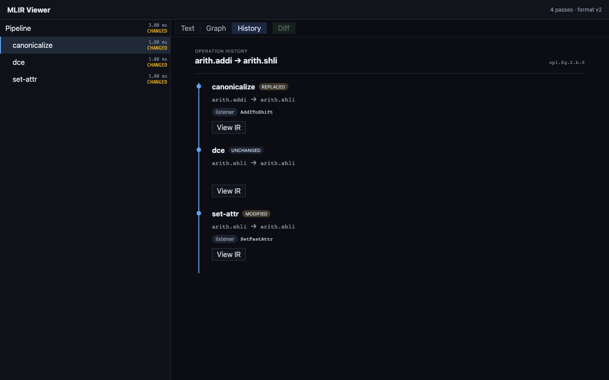

# MLIR Viewer

A visual debugger for MLIR pass pipelines. Capture what every pass did to your
IR into a single self-contained trace file, then explore it in a local web
viewer: per-pass before/after text diffs, a dataflow graph with structural
diff, and the full lifecycle history of any individual operation — which pass
touched it, with which pattern, and how confident the link is.



## How it works

```
your pipeline ──(libmlir-trace, C++)──▶ trace.mlirtrace ──(mlir-viewer serve)──▶ browser
```

- **`capture/`** — `libmlir-trace`, a C++ library built against MLIR 21. A
  `PassInstrumentation` records pass timings, IR snapshots, op byte indexes,
  and op lifecycle events (insert/erase/replace/modify with pattern
  attribution) into a SQLite-based trace file. Fidelity is a ladder:
  `Timeline → Text → Full` — lower fidelities simply record less.
- **`crates/`** — the Rust side: `trace-format` (schema, reader/writer),
  `engine` (parsing, diff, graph extraction, provenance), `server` (axum HTTP
  API, embeds the built UI), `cli` (the `mlir-viewer` binary).
- **`ui/`** — React + TypeScript viewer: virtualized IR text with MLIR
  highlighting, git-style text diff, canvas dataflow graph with ELK layout,
  and the operation History timeline. Exact lifecycle evidence renders solid;
  fingerprint-inferred links render dashed with a score.

## Quick start (no MLIR toolchain needed)

```sh
cargo run -p cli -- dev gen-fixture --full demo.mlirtrace
cargo run -p cli -- serve demo.mlirtrace
# open http://127.0.0.1:3000
```

The synthetic fixture contains a realistic canonicalize/DCE/set-attr pipeline
with identity events, so every viewer feature works without compiling MLIR.

## Capturing a real pipeline

Build `capture/` against your MLIR 21 install (`find_package(MLIR CONFIG)`),
attach the recorder to your `PassManager`, run your pipeline, then serve the
resulting file. See `capture/` and `examples/capture-toy` for a working
example wired end to end.

## Development

```sh
cargo test --workspace          # Rust: format, engine, server
cd ui && npm ci
npm run typecheck && npx vitest run
npm run build                   # production bundle (embedded by the server)
npx playwright test             # end-to-end against the real server
```

### C++ capture library

The `capture/` cmake/ctest suite needs an MLIR 21 toolchain and therefore runs
locally rather than in CI. After building it, the cross-language conformance
test can be pointed at a C++-generated trace:

```sh
MLIR_TRACE_CPP_FIXTURE=build/capture/cpp-demo.mlirtrace \
  cargo test -p trace-format --test conformance -- --ignored
```

## Design documents

Architecture and per-milestone designs live in `docs/superpowers/specs/`,
starting from `2026-07-02-mlir-viewer-design.md`. Milestones M0–M4
(trace format, C++ capture, walking-skeleton UI, diff/graph engine, op
identity + provenance history) are implemented; M5+ (structured inspector,
search, command palette) are next.
